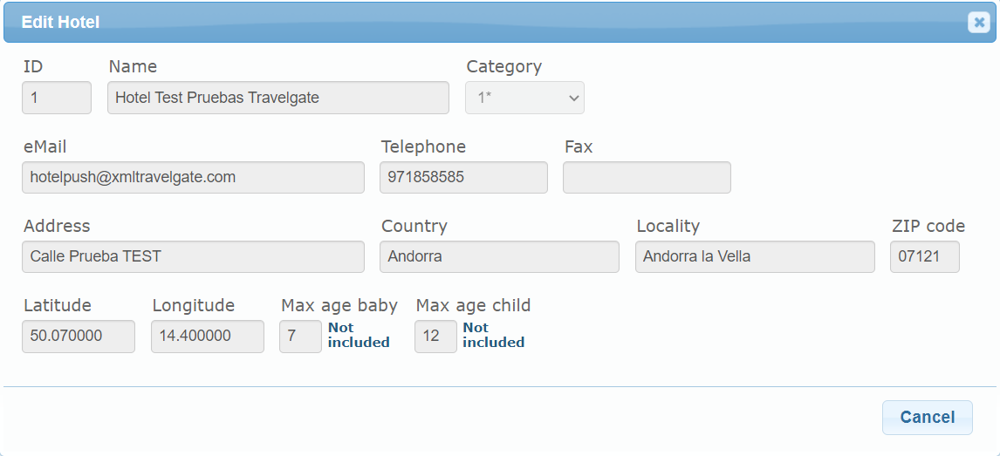
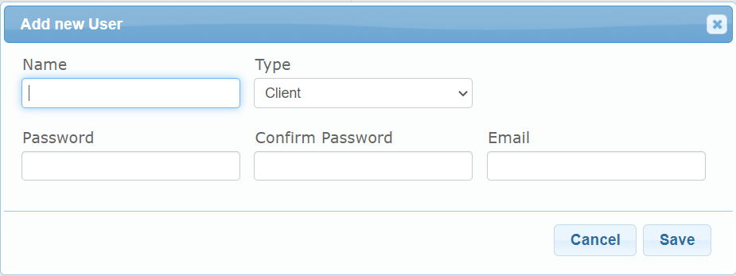
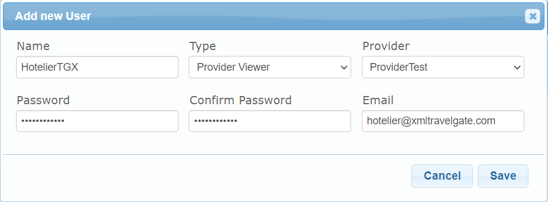

+++
title = "Management"
pagetitle = "Management"
description = "Manage users and hotels"
icon = "fa-list"
weight = 5
alwaysopen = false
isDirectory=false
+++

The Manage section allows you to manage users from your team or hoteliers and also allows you to check hotels details as address, telephone, email...

 

* [Hotels](#hotels)
* [Users](#users)

## Hotels

This section allows you to access the master hotels. Introducing the ID or name and clicking the ``Filter`` button will give you the information of that hotel.

 

As you can see in the previous image, the basic information for each hotel is:

* **ID:** Hotel’s ID set by TravelgateX.
* **Name:** Master hotel name.
* **Provider Assigned:** Channel through which this hotel is connected.
* **Update Date:** Hotel information’s last update date.

If you want to get all the detail information of the hotel, you should click on the pencil icon located on the right of the masterhotel row. A pop up window will appear:

 

## Users

This tool allows you to create, modify or delete users. This users can be created for your team or for the hoteliers that you believe should have access to the Inventory system.  Creating users for hoteliers is not mandatory, but in some cases they ask for it in order to check that all is loaded correctly in the system. In other cases, it is the Channel Manager who demands that the hotelier be given a credential, so the hotelier has to ask the client for a user.

{} In case that the hotelier asks for access to the Inventory extranet, it will be the Buyer who is in charge of creating the user through this tool and not TravelgateX. {}

 

To create a new username click on ``Add new User`` and a pop up window will appear to introduce the username, type of user and a password. You would also need to indicate an email address for this username in case the password is forgotten and has to be recovered.

 

The type of user, or user role, allows the user to do certain actions and view certain sections of the extranet. The different roles or types of users are:

* **Client:** This kind of user will be able to see all the information regarding hotels assigned to them, no matter which the Channel Manager is, and it will be able to do changes on these hotels.
* **Client Admin:** This kind of user will be able to see all the information related to a client, such as hotels or Channel Managers, and will be able to do all sort of modifications. Unlike the *Client role*, it will not be necessary to assign permissions at hotel level. This user role will have access to everything related with the Buyer.
* **Client Viewer:** This type of user allows to see all the information but it does not allow to do any kind of change or modification. It has access to the tabs ``Availability``, ``Calendar``, ``Booking List`` and ``Booking Price Details`` of the section ``Product`` in the extranet.
* **Provider:** A user with this role will be able to see, change and modify information and configurations of the hotels assigned to them. The difference between this and the *Client* role is that it will only have access to the Channels Manager they are related to. The user with *Provider* role will have access to the sections ``Inventory`` and ``Product``.
* **Provider Viewer:** This type of user allows to see all the information but it does not allow to do any kind of change or modification. It has access to the tabs ``Availability``, ``Calendar``, ``Booking List`` and ``Booking Price Details`` of the section ``Product`` in the extranet.

{} Usually, the kind of user that will be create for a hotelier is *Provider Viewer*. {}

When selecting the kind of role, a new field will appear in order for the Channel Manager which it relates to can be indicated, as you can see in the following image:

 

Once the form is filled and verified, you will be able to save the changes by clicking the ``Save`` button. If you want to reject the changes, click the ``Cancel`` button.

 

In case you want to delete a user you have to click the bin icon located on the right of the user row, and click the ``Delete`` button on the pop up window that will appear,

{}